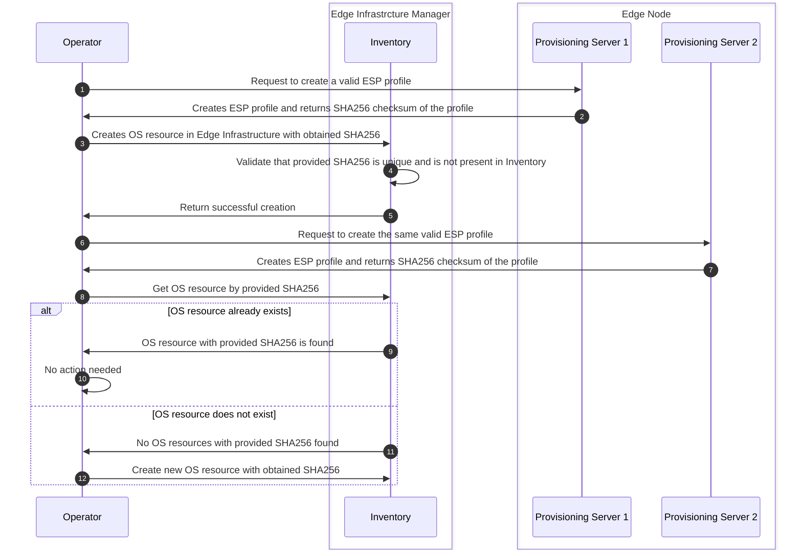
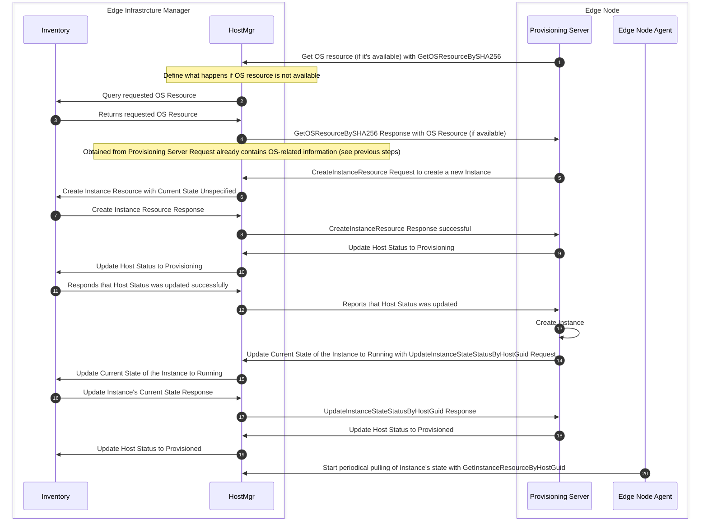
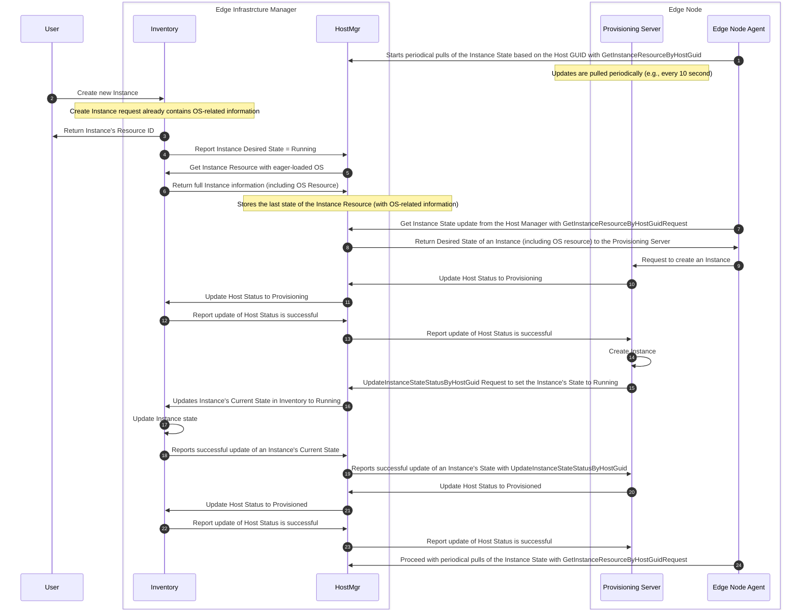
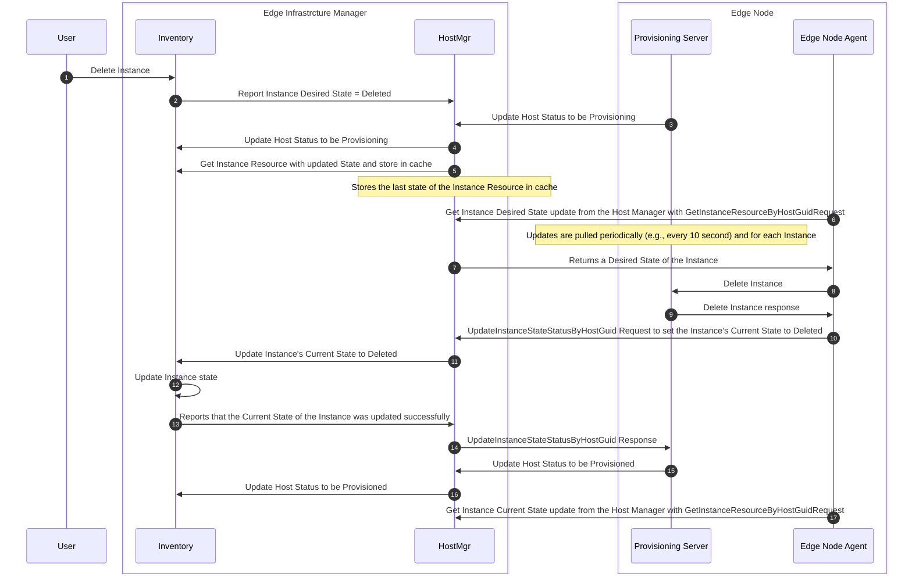

# Instance-related workflow

This document describes the workflow between the `Provisioning Server`, `Edge Node Agent(s)`, and `Host-Manager`
components.

Following section describes `Instance` `Create` and `Delete` workflows. Assuming that the action happens
after the host was `ONBOARDED`. In addition, it assumes ESP Profiles are onboarded in Provisioning Server and OS
Resources are registered in the infrastructure manager, and a unique relationship among an ESP Profile (Provisioning
Server) and an OS Resource is established by an unique SHA256 checksum.

> This document do not seek to cover all backend processes happening in the `Edge Node`.
> Please refer to the corresponding section in order to get more details about that.

## OS Onboarding process

Following diagram clarifies `OS` onboarding process. It is done when an operator wants to onboard in Edge Infrastructure
a new ESP profile, and thus a new option for OSs (or a new OS customisation) that can be installed in an Edge Node.



1. `Operator` creates a valid ESP profile in `Provisioning Server 1`.
    1. Assuming that it includes installing of a custom packages from the corresponding repository.
2. `Provisioning Server 1` returns a SHA256 checksum of an ESP profile to the `Operator`.
    1. SHA256 checksum can be generated based on the specific repository's commit (e.g., example [here](https://stackoverflow.com/questions/61332371/how-to-get-a-sha256-hash-code-for-a-github-repo)).
        1. ESP profile installation artifacts must **NOT** affect SHA256 checksum, thus the checksum generation is
           performed on the tarball file of the specific git commit.
    2. In the case of multiple `Provisioning Servers`, where ESP profiles can be duplicated, we will ensure unique
       identifier for the ESP profile (two identical ESP profiles generate the same SHA256 checksum).
3. `Operator` creates in `Edge Infrastructure` OS resource with obtained SHA256 checksum to ensure its uniqueness
    in `Edge Infrastructure` system.
   1. `SHA256` attribute of the `OS` resource is unique and immutable. Validation check should run each time `OS`
      resource is being created.
4. `Inventory` validates that provided SHA256 is not yet present in `Inventory` and provided `OS` resource is unique.
5. `Inventory` reports about successful `OS` resource creation.
6. `Operator` creates a valid ESP profile in `Provisioning Server 2`.
    1. ESP profile is the same as in step 1.
7. `Provisioning Server 2` returns a SHA256 checksum of an ESP profile to the `Operator`.
    1. SHA256 returned by `Provisioning Server 2` is also the same as the one returned in step 2.
8. `Operator` retrieves from `Inventory` OS resource with provided SHA256 checksum.
9. OS resource with provided SHA256 is found in `Inventory`.
    1. No action is required - OS resource already exists.
10. OS resource with provided SHA256 is **NOT** found in `Inventory`.
    1. `Operator` creates a new OS resource with given SHA256.

## Create Instance

Create `Instance` case is separated into two use cases: Zero-Touch Provisioning (ZTP) case and non-ZTP case.
The two cases differs mostly on who is the actor in charge of creating the `Instance` resource within Inventory.
Only one process can be supported at each time by the `Provisioning Server`.

### ZTP case

In this case, the `Provisioning Server` creates the `Instance` resource in inventory via the `Host-Manager`.

> The following diagram does not pretend to be precise in the internal flow in the `Edge Node`



Description of the steps with Protobuf messages:

1. `Provisioning Server` retrieves one `OS` Resource for that `Host` by OS UUID:

    ```go
    req := &pb.GetOSResourceBySHA256Request{
            Sha256: "valid_sha256_checksum",
    }
    ```

    If OS resource is available in Edge Infrastructure, Instance is created. If OS resource is not available,
    Instance is not created
2. `host-manager` requests `Inventory` for OS resource associated with provided OS UUID.
3. `Inventory` finds OS resource associated with provided OS UUID signature and returns it to the `host-manager`.
4. `host-manager` returns OS resource to `Provisioning Server`. Expected response should be:

    ```go
    resp := &pb.GetOSResourceBySHA256Response{
            Os: &pb.OperatingSystem{
                Sha256: "valid_sha256_checksum",
                KernelCommand: "Some_Kernel_Command",
                OsRepoUrl: "Some_OS_Repo_Url",
                CustomRepos: []string{"Custom_repo_1", "Custom_Repo_2", ...},
                Description: "OS_description",
                Architecture: "x86",
          },
    }
    ```

5. `Provisioning Server` creates a `CreateInstanceResourceRequest`:

    ```go
    req := &pb.CreateInstanceResourceRequest{
      Instance: &pb.Instance{
          HostGuid: "valid_host_GUID",
          ProviderStatusDetail: "human_readable_instance_name",
          InstanceState: INSTANCE_STATE_UNSPECIFIED,
          InstanceStatus: INSTANCE_STATUS_UNSPECIFIED,
          OsSha256: "valid_OS_sha256_checksum",
         },
    }
    ```

6. `host-manager` requests `Inventory` to create `Instance` on the defined `Host` with defined `OS`.
    1. `Desired State` is equal to `RUNNING`.
7. `Inventory` creates an `Instance` with given parameters and returns response.
8. `host-manager` reports success. It returns an empty message to `Provisioning Server` and it is necessary to check
   that returned `error` is `nil`.
9. `Provisioning Server` updates the `Host Status` to `PROVISIONING`.
10. `host-manager` updates the `Host Status` to `PROVISIONING` in `Inventory`.
11. `Inventory` reports that `Host Status` was updated successfully.
12. `host-manager` reports to `Provisioning Server` success in `Host Status` update.
13. `Provisioning Server` creates an `Instance` and starts it.
    1. If a failure occurred during the `Instance` creating, `Provisioning Server` reports the `Instance` status
       to the `host-manager`, which consequently updates it in `Inventory`.
    2. `Instance` status is also reported in case of successful `Instance` creation.
14. Once `Instance` creation is finalised, `Provisioning Server` updates `Instance` state and status to `RUNNING`.

    ```go
    req := &pb.UpdateInstanceStateStatusByHostGuidRequest{
        UUID: "valid_host_GUID",
        InstanceState: INSTANCE_STATE_RUNNING,
        InstanceStatus: INSTANCE_STATUS_RUNNING,
        ProviderStatusDetail: "details_about_instance_status",
    }
    ```

    It returns an empty message to `Provisioning Server` and it is necessary to check that returned `error` is `nil`.

15. `host-manager` updates `Instance` state in `Inventory` to `RUNNING`.
16. `Inventory` grants an update of the `Instance` state.
17. `host-manager` reports success. Same as in step 8, it returns an empty message to `Provisioning Server`.
    It is necessary to check that returned `error` is `nil`.
18. `Provisioning Server` updates `Host Status`to `PROVISIONED`.
19. `host-manager` updates `Host Status` to `PROVISIONED` in `Inventory`.
20. `Edge Node Agent` starts to pull updates of the `Instance` periodically (e.g., each 10 seconds).
    1. `Edge Node Agent` should also periodically update the status of the `Instance` for liveness tracking (e.g.,
       each 15 seconds).

    ```go
    req := &pb.GetInstanceResourceByHostGuidRequest{
            Instance: &pb.Instance{
                HostGuid: "valid_host_GUID",
            },
    }
    ```

### non-ZTP case - User-driven Instance creation

In this case, the `Create` request comes from the end `User` via `infrastructure manager` APIs.



Description of the steps with Protobuf messages:

1. `Edge Node Agent` starts periodical pulling of the `Instance` state updates with `GetInstanceResource` request based
   on the `Host` `UUID`.

2. ```go
    req := &pb.GetInstanceResourceByHostGuidRequest{
            Instance: &pb.Instance{
                HostGuid: "valid_host_GUID",
            },
    }
    ```

3. `User` creates an `Instance` via APIs with `Create` request. The request already contains OS-related
   information.
4. `Inventory` returns Resource ID of the `Instance` to the `User`.

5. Once request drills down to the `Inventory`, it reports an `Instance` `Desired State` to the `host-manager`.
6. `host-manager` pulls all `Instance`-related information (including `OS` information).
7. `host-manager` obtains `Instance`'s information.
8. Once periodical pull reaching the `host-manager`, it gets an updated `Desired State` of the `Instance` on the `Host`.

    ```go
    req := &pb.GetInstanceResourceRequestByHostGuid{
            Instance: &pb.Instance{
                HostGuid: "valid_host_GUID",
            },
    }
    ```

9. `Provisioning Server` gets an updated `Desired State` of the `Instance` with all `Instance`-related
   information (including `OS` information).

    ```go
    resp := &pb.GetInstanceResourceResponse{
        Instance: &pb.Instance{
            HostGuid: "valid_host_GUID",
            ProviderStatusDetail: "human_readable_instance_name",
            InstanceState: INSTANCE_STATE_RUNNING,
            OsSha256: "valid_OS_sha256_checksum",
        },
    }
    ```

10. `Edge Node Agent` requests `Provisioning Server` to create an `Instance`.
11. `Provisioning Server` updates `Host Status` to `PROVISIONING`.
12. `host-manager` updates the `Host Status` in `Inventory` to `PROVISIONING`.
13. `Inventory` reports that the `Host Status` was updated successfully.
14. `host-manager` reports that the `Host Status` was updated in `Inventory`.
    1. It returns an empty message to `Provisioning Server` and it is necessary to check that returned `error` is `nil`.
15. `Provisioning Server` performs create `Instance` action.
16. Once `Instance` is created, `Provisioning Server` updates the state of the `Instance` to `RUNNING`.
    1. Alternatively, if `Instance` is failed to create, `Provisioning Server` updates `Instance` state to `ERROR`.

    ```go
    req := &pb.UpdateInstanceStateStatusByHostGuidRequest{
        HostGuid: "valid_host_GUID",
        CurrentState: INSTANCE_STATE_RUNNING,
        InstanceStatus: INSTANCE_STATUS_RUNNING,
        ProviderStatusDetail: "human_readable_instance_name",
    }
    ```

17. `host-manager` updates `Instance`'s `Current State` to `RUNNING`.
18. `Inventory` updates `Instance`'s state.
19. `Inventory` reports the result of the update to the `host-manager`.
20. `host-manager` reports the result of the `Instance`'s state update to the `Provisioning Server`.
    1. It returns an empty message to `Provisioning Server` and it is necessary to check that returned `error` is `nil`.
21. `Provisioning Server` updates `Host Status`to `PROVISIONED`.
22. `host-manager` updates `Host Status` to `PROVISIONED` in `Inventory`.
23. Reports result of an update of a `Host Status` to the `host-manager`.
24. `host-manager` reports the result of the `Instance`'s state update to the `Provisioning Server`.
    1. It returns an empty message to `Provisioning Server` and it is necessary to check that returned `error` is `nil`.
25. `Edge Node Agent` proceeds with periodical pulls.

## Delete Instance

`Delete` request is always coming from the end `User` and thus `Provisioning Server` is only required to track
the state of the `Instance` (with `Get` request) and make appropriate changes to the `Instance` (in Edge Node)

> The scope of the Delete `Instance` case is not yet clearly defined - this is TBD in the future
> to allow Edge Node Agent making de-provisioning from cloud setup



Description of the steps with Protobuf messages:

1. `User` makes a `Delete` request in order to delete an `Instance`.
2. `Inventory` reports to the `host-manager` that the `Desired State` of the `Instance` is `DELETED`.
3. `Provisioning Server` updates the `Host Status` to be `PROVISIONING`.
4. `host-manager` updates the `Host Status` to be `PROVISIONING` in `Inventory`.
5. `host-manager` pulls all `Instance` related information (including `OS` information).
6. Once periodical pull reaching the `host-manager`, it gets an updated `Desired State` of the `Instance` on the `Host`.

    ```go
    req := &pb.GetInstanceResourceByHostGuidRequest{
            Instance: &pb.Instance{
                Uuid: "valid_host_GUID",
            },
    }
    ```

7. `host-manager` returns a response with updated `Desired State` of the `Instance`.

    ```go
    resp := &pb.GetInstanceResourceByHostGuidResponse{
        Instance: &pb.Instance{
            HostGuid: "valid_host_GUID",
            ProviderStatusDetail: "human_readable_instance_name",
            InstanceState: INSTANCE_STATE_DELETE,
            OsSha256: "valid_OS_sha256_checksum",
        },
    }
    ```

8. `Edge Node Agent` requests `Provisioning Server` to perform an `Instance` delete.
9. `Provisioning Server` performs an `Instance` delete and reports it to `Edge Node Agent`.
10. `Edge Node Agent` updates `Instance`'s `Current State` with `UpdateInstanceStateStatusByHostGuid` request.

    ```go
    req := &pb.UpdateInstanceStateByHostGuidRequest{
        HostGuid: "valid_host_GUID",
        InstanceState: INSTANCE_STATE_DELETED,
        InstanceStatus: INSTANCE_STATUS_UNSPECIFIED,
        ProviderStatusDetail: "details_of_the_current_status_of_the_instance",
    }
    ```

11. `host-manager` requests `Inventory` to update `Current State` of the `Instance` to be `DELETED`.
12. `Inventory` updates `Current State` of the `Instance`.
13. `Inventory` reports to the `host-manager` successful update of the `Instance`'s `Current State`.
14. `host-manager` reports to the `Edge Node Agent` success in updating `Instance`'s `Current State`.
    1. `host-manager` returns an empty message to `Edge Node Agent` and it is necessary to check that returned `error`
       is `nil`.
15. `Provisioning Server` updates `Host Status` to be `PROVISIONED`.
16. `host-manager` updates `Host Status` in the `Inventory` to be `PROVISIONED`.
17. `Edge Node Agent` can keep pulling updates of the `Instance` resource by `Host GUID`.

Once `Instance` is defined again (i.e., `Desired State` has changed), re-provisioning steps take place.
