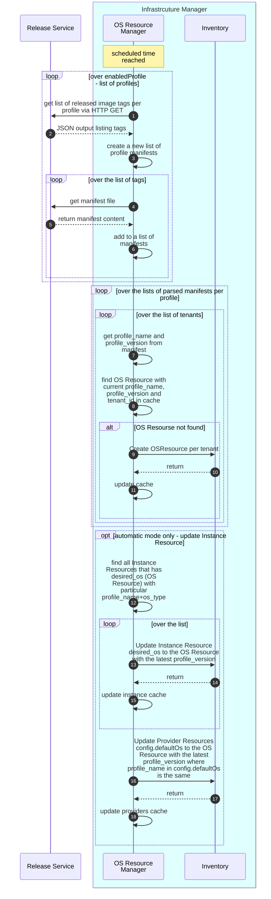

# Architecture and Internals

OS Resource Manager can be configured to operate in two modes: automatic or manual.

- Automatic Mode (default): OS Resource Manager creates new OS Resources and automatically attaches the latest
  OS Resource to all Instance Resources currently using the same profile name. OS Resource Manager will update
  defaultOs in the Provider Resource config field as during EN onboarding it is expected that the installed OS
  is the latest one.
- Manual Mode: OS Resource Manager creates new OS Resources, and the user is responsible for attaching them to
  the Instance Resource for each EN via the CLI (using NB API). The user will also update defaultOs in
  the Provider Resource.

To align with the Multitenancy concept each OS Resource must have a Tenant ID assigned. OS Resource Manager will
create an OS Resource per each Tenant, thus, OS Resource Manager will need to control Tenant Resources in
the Inventory and create new OS Resources per new tenants.

The OS Resource Manager will utilize two clients:

- HTTP Client: This client will access the file server within the Release Service, sending HTTP GET requests via the
  access proxy. The HTTP client will be implemented using Go's standard net/http library.
- Inventory Client: This gRPC client will interact with the Inventory database to:
  - create OS Resources
  - listen for events from Inventory in regards to Tenant Resource, Provider Resource and Instance Resource
  - get Tenant Resources, Provider Resources, Instant Resources and OS Resources
  - update `desired_os` field in Instance Resources to the latest OS
  - update `defaultOs` in `config` string in Provider Resource

## OS Resource Manager Initialization Flow

```mermaid
sequenceDiagram
%%{wrap}%%
autonumber
participant rs as Release Service
box LightCyan Infrastructure Manager
    participant inv as Inventory
    participant im as OS Resource Manager
end
note over im: start OS Resource Manager
im->>inv: subscribe for event notifications in regards to Tenant Resource, Provider Resource and Instance Resource
im->>inv: list all Tenant Resources
im->im: save tenants in cache
im->>inv: list all Provider Resources
im->im: save providers in cache
im->>inv: list all Instance Resources
im->im: save instances in cache
loop over defaultProfiles
    im->>rs: get list of released image tags via HTTP GET per profile repo
    rs-->>im: JSON output listing tags
    loop over the list of tags
        im->>rs: get manifest file
        rs-->>im: return file content
        im->>im: add to a list of manifests
    end
    loop over the list of manifests
        loop over the cached tenants
            im->>inv: Create OS Resource per tenant
            inv-->>im: return
            im->>im: cache OS Resource
        end
    end
    opt automatic mode
        im->>inv: update desired_os in Instance Resource where OS Resource in desired_os has the same profile_name that the OS Resource with latest profile_version
        inv-->>im: return
        im->>im: update instance cache
        im->>inv: update config.defaultOs in Provider Resource where OS Resource in defaultOs has the same profile_name
        inv-->>im: return
        im->>im: update providers cache
    end
end
opt receive event notification related to Tenant Resource
    inv->>im: notify
    im->>inv: list all Tenant Resources with currentState=created
    inv-->>im: return list
    im->>im: cache tenants
    im->>inv: create OS Resources per new tenants
end
opt automatic mode
    opt receive event notification related to Provider Resource
        inv->>im: notify
        im->>inv: list all Provider Resources with currentState=created
        inv-->>im: return list
        im->im: cache providers
        im->>inv: update new Provider Resource config.defaultOs
    end
    opt receive event notification related to Instance Resource
        inv->>im: notify
        im->>inv: list all Instance Resources
        inv-->>im: return list
        im->im: cache instances
        im->>inv: update new Instance Resource desired_os
    end
end
```

### New OS Resource Creation Flow

